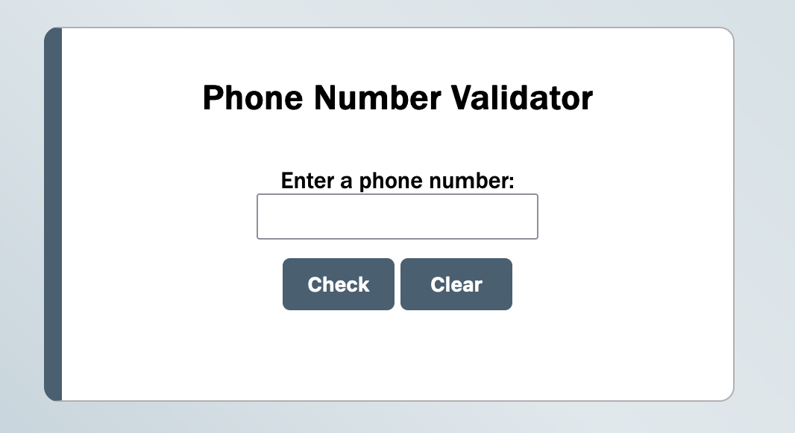

### Telephone Number Validator

This project checks if the given input is a valid US phone number.

#### Using the Telephone Number Validator

Enter the number you would like to check into the input field, then press the _Check_ button.

#### Test Cases

The input `1 555-555-5555` should return `"Valid US number: 1 555-555-5555"`.
The input `1 (555) 555-5555` should return `"Valid US number: 1 (555) 555-5555"`.
The input `555-5555` should return `"Invalid US number: 555-5555"`.
The input `1 456 789 4444` should return `"Valid US number: 1 456 789 4444"`.

#### freeCodeCamp Disclaimer

This project was completed as part of [freeCodeCamp.org](https://www.freecodecamp.org)'s _JavaScript Algorithms and Data Structures_ course. This was a Certification Project, meaning [freeCodeCamp](https://www.freecodecamp.org) provided specifications and limited guidance and I was expected to code to meet certain test cases. The code presented here is my own.
